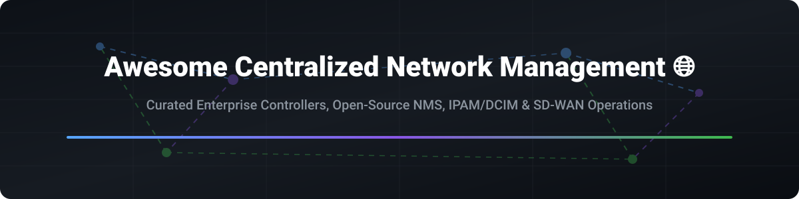

# Awesome-Centralized-Network-Management

# Awesome-Centralized-Network-Management 🌐 ⚙️



  





  
  
  
  
  
  



---

## 🌟 Top Centralized Network Management Ecosystem

**Curated List of Commercial Network Management Platforms & Open-Source Network Automation Tools**  
*Focused on Network Monitoring, Configuration Management, IPAM/DCIM, SD-WAN Orchestration & Self-Hosted Network Operations*

**Last updated: October 2026** 📅

---

### 📌 Overview & SEO Summary
Welcome to the ultimate curated directory of **centralized network management platforms**, **open-source network automation tools**, and **self-hosted network operations centers**. Whether you are looking for enterprise-grade commercial solutions (such as *Cisco DNA Center*, *Juniper Mist*, and *Aruba Central*), or self-hostable open-source alternatives (like *NetXMS*, *NetBox*, *Zabbix*, and *OpenWISP*), this list covers category leaders, network controllers, and privacy-respecting network management stacks.

---

## 📑 Table of Contents
- [🏢 SaaS & Commercial Platforms](#-saas--commercial-platforms)
- [🔓 Open-Source GitHub Projects](#-open-source-github-projects)
- [🛠️ How to Contribute](#%EF%B8%8F-how-to-contribute)
- [📊 Star History](#-star-history)
- [🤝 Support & Sponsorship](#-support--sponsorship)
- [⚠️ Disclaimer](#%EF%B8%8F-disclaimer)

---

## 🏢 SaaS / Commercial Platforms

The centralized network management market is dominated by vendor-specific cloud controllers that lock in hardware ecosystems, alongside cloud provider network management services. Pricing models typically combine per-device licensing with subscription fees, and many platforms require multi-year commitments. Cisco DNA Center, Juniper Mist, and Aruba Central each provide AI-driven insights but primarily manage their own hardware, creating vendor lock-in that open-source alternatives explicitly aim to eliminate.

| SaaS / Commercial Platform | Company / Owner | Valuation / Market Cap | Standard Edition Starting Price | Free Tier / Free Trial Limits | Description |
| :--- | :--- | :--- | :--- | :--- | :--- |
| **[AWS Network Manager](https://aws.amazon.com/network-manager/)** ☁️ | Amazon | ~$2.0 Trillion | Pay-as-you-go for global networks and transit gateways | No free tier for Network Manager | **AWS-native network management** — Centralized visibility and control of AWS global networks. Integrates with Transit Gateway, Cloud WAN, and SD-WAN. |
| **[Cisco DNA Center](https://www.cisco.com/)** 🔵 | Cisco Systems | ~$200 Billion | Custom per-device licensing | Demo available | **Cisco's network controller** — Intent-based networking with AI/ML insights. Manages Cisco Catalyst, Meraki, and SD-WAN. |
| **[Juniper Mist AI](https://www.juniper.net/)** 🟣 | Juniper Networks | ~$10 Billion | Custom subscription | Free trial available | **AI-driven network management** — Mist AI for wireless, wired, and WAN. Marvis virtual assistant for troubleshooting. |
| **[Aruba Central](https://www.arubanetworks.com/)** 🟠 | HPE (Aruba) | ~$60 Billion (HPE) | Custom per-device subscription | Free trial available | **Cloud-managed networking** — Aruba's cloud platform for switches, APs, and SD-WAN. AI Insights and network assurance. |
| **[Meraki Cloud Dashboard](https://meraki.cisco.com/)** 🟢 | Cisco Systems | ~$200 Billion | Per-device licensing | Free trial available | **Cloud-managed IT** — Meraki dashboard for switches, APs, security appliances, and cameras. |
| **[FortiManager Cloud](https://www.fortinet.com/)** 🔴 | Fortinet | ~$60 Billion | Custom per-device licensing | Free trial available | **Fortinet security management** — Centralized management of FortiGate firewalls and SD-WAN. |
| **[VMware SD-WAN Orchestrator](https://www.vmware.com/)** 🏢 | Broadcom (VMware) | ~$60 Billion | Custom enterprise pricing | Demo available | **SD-WAN management** — Centralized orchestration for VMware SD-WAN edges. |
| **[ExtremeCloud IQ](https://www.extremenetworks.com/)** 🌐 | Extreme Networks | ~$2 Billion | Custom per-device subscription | Free trial available | **Cloud network management** — AI/ML-driven insights for Extreme networks. |
| **[Palo Alto Panorama](https://www.paloaltonetworks.com/)** 🛡️ | Palo Alto Networks | ~$60 Billion | Custom enterprise pricing | Demo available | **Security management** — Centralized management of Palo Alto firewalls and Prisma Access. |
| **[Cradlepoint NetCloud](https://cradlepoint.com/)** 📡 | Ericsson (Cradlepoint) | ~$30 Billion (Ericsson) | Custom per-device subscription | Free trial available | **Wireless WAN management** — Cloud management for cellular routers and 5G edge solutions. |

---

## 🔓 Open-Source GitHub Projects

*Sorted by GitHub_Stars_Count (Descending)* 🌟

- **[NetBox](https://github.com/netbox-community/netbox)**   
  **The cornerstone of every automated network**, Apache-2.0 licensed. **16,000+ stars**. **IPAM and DCIM tool** that serves as the central source of truth for network infrastructure. Comprehensive data model: racks, devices, cables, IPs, VLANs, circuits, power, VPNs. **Does not interact with network nodes directly** — makes data available programmatically to automation, monitoring, and assurance tools. Custom fields, plugins, Jinja2 config rendering, REST API, and comprehensive change logging. **The de facto standard for network source of truth** . 

- **[Zabbix](https://github.com/zabbix/zabbix)**   
  **Enterprise-class open-source distributed monitoring solution**, AGPL-3.0 licensed. **Monitors performance and availability of network devices, servers, VMs, applications, and cloud** . Resource discovery, metric acquisition (agent and agentless), root cause analysis, multi-channel alerting (Slack, JIRA, Teams, email, SMS). **Single pane of glass** for graphs, lists, geomaps, and topology maps. **Multitenancy and distributed monitoring** across data centers and organizations. Scales from standalone applications to large-scale environments . 

- **[NetXMS](https://github.com/netxms/netxms)**   
  **Enterprise-grade open-source network and infrastructure monitoring solution**, GPL-2.0-or-later licensed. **237 stars**. **Unified solution** — monitor and manage entire IT infrastructure from network switches to applications. **Distributed architecture** with central management server, agents, and web/desktop clients. Automatic network discovery, SNMP monitoring (all versions), real-time log analysis, topology-based event correlation, NXSL scripting. **Used by RAA School (UK), University of Florence (Italy), Government of Burkina Faso** . 

- **[LibreNMS](https://github.com/librenms/librenms)**   
  **Community-based GPL-licensed network monitoring system**, GPL-3.0 licensed. **3,852 stars**. Auto-discovery, SNMP polling, alerting, and extensive device support. **The most widely adopted open-source network monitoring platform** for infrastructure engineers. 

- **[Oxidized](https://github.com/ytti/oxidized)**   
  **Network device configuration backup tool (RANCID replacement)**, Apache-2.0 licensed. **2,792 stars**. Automatically backs up configurations from 100+ network device vendors. Git, MySQL, and REST API backends. **The standard for automated config backups** . 

- **[phpIPAM](https://github.com/phpipam/phpipam)**   
  **Open-source IP address management**, GPL-3.0 licensed. **2,234 stars**. Lightweight and modern web-based IPAM. Sections, subnets (IPv4/IPv6), VLANs, VRFs, NAT, and discovery. REST API for automation. **The most popular open-source IPAM** . 

- **[Ralph](https://github.com/allegro/ralph)**   
  **CMDB / Asset Management system for data center and back office hardware**, Apache-2.0 licensed. **2,227 stars**. Data center inventory management with DCIM capabilities. 

- **[rConfig](https://github.com/rconfig/rconfig)**   
  **Network configuration management**, GPL-3.0 licensed. **Configuration backup, multi-vendor support, unlimited devices, config versioning and diff, REST API** . Core edition free; Professional adds change manager and review workflow. Docker and native installation. 

- **[OpenWISP](https://github.com/openwisp/openwisp-controller)**   
  **Modular and programmable open-source network management system for OpenWrt**, GPL-3.0 licensed. **Controller: 777 stars; Radius: 445 stars; netjsonconfig: 388 stars** . **Centralized configuration management, automated provisioning, X.509 PKI, management VPN (OpenVPN, WireGuard, ZeroTier)** . Ecosystem: monitoring, firmware upgrader, network topology, IPAM, notifications, and RADIUS. **Designed for OpenWrt but extensible to other systems** . 

- **[Cacti](https://github.com/Cacti/cacti)**   
  **Network graphing solution**, GPL-2.0 licensed. **1,640 stars**. Frontend for RRDtool. Complete network graphing, data collection, and visualization. 

- **[Checkmk](https://github.com/Checkmk/checkmk)**   
  **Best-in-class infrastructure and application monitoring**, GPL-2.0 licensed. **1,560 stars**. Modern monitoring with auto-discovery and extensive plugin ecosystem. 

- **[Firefly](https://github.com/firefly-iii/firefly-iii)**   
  **Network automation platform (Firefly)**, open-source. **815 stars**. Vendor-agnostic network automation with enterprise capabilities. 

- **[PacketFence](https://github.com/inverse-inc/packetfence)**   
  **Network access control (NAC) solution**, GPL-3.0 licensed. **1,349 stars**. Trusted, Free and Open Source NAC with impressive feature set. 

- **[flexiWAN](https://github.com/flexiwan)**   
  **Open-source SD-WAN platform**, open-source. **World's first production-ready open and community-driven SD-WAN solution** . Multi-tenant management, zero-touch provisioning, IPsec over VxLAN tunnels, internet breakout. **Eliminates vendor lock-in** by allowing interoperability with third-party applications. Runs on any x86-based white box. Source code available for flexiManager and flexiEdge . 

- **[Akraino SD-EWAN](https://gerrit.akraino.org/r/admin/repos/icn/sdwan)**   
  **Cloud-native SD-WAN controller**, open-source. **OpenWRT-based SD-WAN CNFs with cloud-native SD-WAN controller and IPSec controller** . Zero-touch automation. Centralized configuration controller. Works with third-party SD-WAN VNFs. **Part of Linux Foundation Edge (LF Edge) Akraino project** . 

---

## 🛠️ How to Contribute

Contributions are welcome! Follow these steps to submit new centralized network management platforms or open-source network tools:

1. 🍴 **Fork** the repository.
2. 📝 **Add/edit** entries in `README.md` maintaining table/list structure and formatting.
3. 🔗 Include project title, official website/GitHub link, exact Stars_Count, license, and brief description.
4. 🚀 Submit a **Pull Request** with a descriptive summary of your changes.

---

## 📊 Star History



---

## 🤝 Support & Sponsorship

If you find this centralized network management repository useful, please consider supporting the project:

- ⭐ **Star** this repository to increase visibility!
- 🔀 **Fork** and share with fellow network engineers, DevOps practitioners, and open-source advocates.
- ☕ **Sponsor & Buy Me a Coffee**: Support ongoing open-source curation via the [GitHub Sponsor Dashboard](https://github.com/sponsors/ishandutta2007).

---

## ⚠️ Disclaimer

- This is a **community-curated** list — not exhaustive and not an endorsement. ℹ️
- Commercial network controllers (Cisco DNA Center, Juniper Mist, Aruba Central) provide AI-driven insights but primarily manage their own hardware ecosystems, creating **vendor lock-in**. Open-source alternatives like NetBox, Zabbix, and OpenWISP explicitly aim to eliminate this lock-in by supporting multi-vendor environments . 
- **OpenWISP** is designed primarily for OpenWrt but extensible to other systems. **flexiWAN** requires x86-based white box hardware. **NetXMS** and **Zabbix** scale from small to large deployments but require proper architectural planning for distributed monitoring . 
- Open-source network management tools provide self-hosted ownership and transparency, but enterprise-grade SLA guarantees, 24/7 support, and managed infrastructure remain primarily commercial offerings. **Always validate network changes in a lab environment** before applying to production. 🌐

---



  <b>Made with ❤️ for network engineers, infrastructure teams, and open-source network management advocates.</b>

